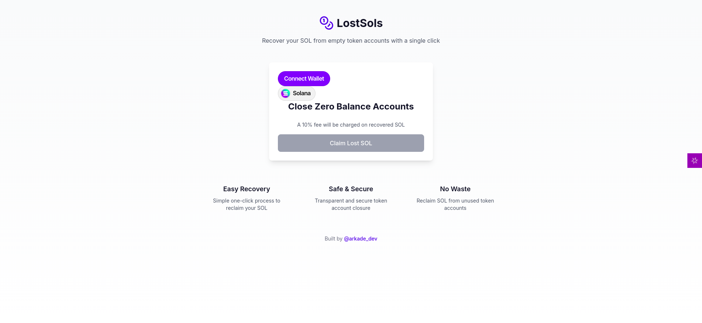

# Lost SOLs

## What is Lost SOLs?
Lost SOLs is a user-friendly application that helps Solana users reclaim locked SOL from unused token accounts. When you interact with tokens on Solana, small amounts of SOL get locked in token accounts. Even after you've used or transferred all tokens, this SOL remains locked. Lost SOLs helps you recover these trapped funds efficiently and safely.



## Built with Reown AppKit
Lost SOLs is powered by Reown AppKit, a powerful and open-source Web3 development solution that provides:

- **Seamless Wallet Integration**: Easy connection to multiple wallet providers
- **One-Click Authentication**: Simplified user login and verification
- **Cross-Chain Compatibility**: Support for both EVM and non-EVM chains
- **Enhanced Security**: Robust security features for wallet connections
- **Open Source**: Full transparency and community-driven development
- **Free to Use**: No hidden costs or licensing fees

The integration of Reown AppKit ensures Lost SOLs provides a reliable, secure, and user-friendly experience while maintaining high standards of transparency and efficiency.

## Key Benefits
- **Recover Lost SOL**: Find and reclaim SOL locked in empty token accounts
- **Batch Processing**: Close multiple accounts at once, saving time and transaction fees
- **User-Friendly Interface**: Simple one-click process to recover your funds
- **Real-Time Updates**: Track the progress of your recovery process
- **Secure Operations**: All transactions require your wallet approval

## How It Works

### 1. Account Discovery
- Connect your wallet
- Lost SOLs automatically scans for empty token accounts
- You'll see how many accounts were found and the total SOL available to recover

### 2. Recovery Process
- Click "Claim Lost SOL" to start the process
- A 10% service fee is applied to recovered SOL
- Accounts are processed in batches for efficiency
- Real-time status updates keep you informed

### 3. Confirmation
- Each transaction is confirmed on the Solana network
- You'll receive transaction signatures for verification
- Links to Solana Explorer for transaction tracking
- Clear success/failure notifications

## Service Fee
- A 10% fee is applied to all recovered SOL
- Fee is automatically calculated and clearly displayed
- Helps maintain and improve Lost SOLs
- Transparent fee structure with no hidden costs

## User Guide

### Getting Started
1. Visit Lost SOLs [website](https://lostsols.vercel.app/)
2. Click "Connect Wallet" and approve the connection
3. Wait for the account scan to complete
4. Review the found accounts and potential SOL recovery
5. Click "Claim Lost SOL" to begin the recovery process

### Understanding Status Messages
- **Scanning**: "Fetching token accounts..."
- **Found Accounts**: "Found X zero balance accounts. Closing..."
- **Processing**: Shows progress (e.g., "Closed 5 out of 10 accounts")
- **Success**: "All accounts closed successfully!"
- **Transaction Details**: Includes signatures and Explorer links

### Best Practices
- Ensure your wallet has enough SOL for transaction fees
- Keep your wallet connected throughout the process
- Wait for confirmation messages before closing the page
- Save transaction signatures for your records

## Common Questions

### Q: How much SOL can I recover?
A: The amount varies based on how many empty token accounts you have. Each account typically holds about 0.002 SOL in rent.

### Q: Why is there a 10% fee?
A: The fee helps cover:
- Ongoing maintenance and updates
- Network infrastructure costs
- Customer support services
- Future feature development

### Q: Is it safe to use?
A: Yes! Lost SOLs:
- Only closes empty token accounts
- Requires your explicit approval for all transactions
- Never has access to your private keys
- Uses secure wallet connections

### Q: What if my transaction times out?
A: Don't worry! You'll receive:
- A transaction signature
- A link to track the transaction on Solana Explorer
- Clear status updates about your transaction

### Q: How long does it take?
A: The process typically takes:
- 30 seconds for scanning accounts
- 1-2 minutes for processing (varies by number of accounts)
- A few seconds for network confirmation

## For Developers
Lost SOLs is built using modern Web3 and full-stack technologies. For developers interested in contributing or building similar applications:

### Technology Stack
- **Next.js**: Full-stack React framework
  - Server-side rendering
  - API routes
  - File-based routing
  - Built-in optimizations
- **Reown AppKit**: Core Web3 functionality
  - Wallet connections
  - Authentication
  - Transaction handling
  - Cross-chain compatibility
- **Solana Web3.js**: Blockchain interactions
- **TypeScript**: Type-safe development

### Integration Steps

1. Clone the repositary:
```bash
git clone https://github.com/arkade-01/LostSols.git
cd LostSols
```

2. Install required dependencies:
```bash
npm install @reown/appkit @reown/appkit-adapter-solana @solana/web3.js @solana/spl-token
```

3. Start the server:
```bash
npm run dev
```


### Best Practices
- Use Next.js 14's app router for optimal performance
- Implement proper error boundaries
- Handle loading and error states
- Follow TypeScript best practices
- Utilize Next.js built-in optimizations

For more detailed documentation and examples:
- [Next.js Documentation](https://nextjs.org/docs)
- Reown AppKit Documentation
- [Solana Web3.js Documentation](https://solana-labs.github.io/solana-web3.js)

## Support

### Need Help?
- Check transaction status: https://solscan.io
- Twitter updates: https://x.com/arkade_dev

### Troubleshooting Tips
- Ensure your wallet is properly connected
- Check you have enough SOL for transaction fees
- Verify your internet connection is stable
- Keep the page open until process completion

## Updates and Improvements
We regularly update Lost SOLs to provide:
- Faster processing speeds
- Better success rates
- Enhanced user interface
- Additional features based on user feedback

Stay connected through our social channels for the latest updates and features!

## Terms of Use
- Lost SOLs is provided as-is
- 10% fee is non-negotiable and automatic
- Users must approve all transactions
- Network fees are separate from our service fee

## Privacy and Security
- We never store your private keys
- Only public wallet addresses are processed
- All transactions require user approval
- No personal data is collected or stored

Remember: Always verify transaction details before approval and keep your transaction signatures for reference.

---

Thank you for choosing Lost SOLs for managing your Solana token accounts!